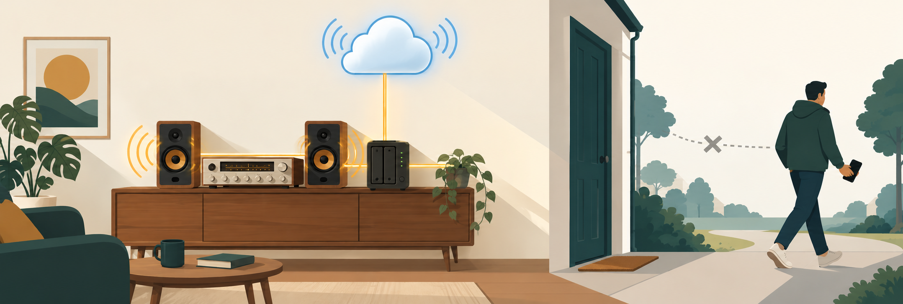

# SpotConnect package for Synology NAS and Synology Router

| License                                                                                         | Issues                                                                                                                                            |
| ----------------------------------------------------------------------------------------------- | ------------------------------------------------------------------------------------------------------------------------------------------------- |
|  |  |

**Your old speakers, in the Spotify app, as real devices.**

A Synology package for [SpotConnect](https://github.com/philippe44/SpotConnect): it makes
UPnP/DLNA and AirPlay speakers appear in Spotify as genuine **Spotify Connect** devices.
Your NAS holds the stream, not your phone — so the music keeps playing when you walk out
of the door, and anyone in the house can take over from any Spotify app, Android
included.

> ⚠️ **Pre-release.** This package has not yet been verified on real hardware. Values
> marked _provisional_ below are expected to be right, not measured. This notice is
> removed once the first release is tested.

## Table of contents

- [How it works](#how-it-works)
- [What can I connect?](#what-can-i-connect)
- [I already have AirConnect — do I need this?](#i-already-have-airconnect--do-i-need-this)
- [Why run this on a NAS?](#why-run-this-on-a-nas)
- [Which package do I need?](#which-package-do-i-need)
- [Install](#install)
- [Spotify sign-ins](#spotify-sign-ins)
- [Configuration](#configuration)
- [Known limitations](#known-limitations)
- [Building from source](#building-from-source)
- [License](#license)
- [Credits](#credits)

## How it works

1. Install the package on your NAS and pick which bridge you need in the wizard.
2. SpotConnect scans your network and finds the speakers you already own — the Denon
   receiver, the Yamaha, the AirPort Express. For each one it creates a virtual Spotify
   Connect device.
3. Open Spotify on your phone and tap the device button. **Your speakers are in the list
   — by name, one entry each. Not your NAS: the actual speakers.** They carry a `+`
   (`Living Room+`), which is how you tell them apart from the same speaker's AirPlay
   entry if you also run AirConnect.
4. Pick a song and tap `Living Room+`. Spotify hands the stream to your NAS; the NAS
   decodes it and feeds the Denon. Music plays.
5. Your phone now just says _Playing on Living Room+_. It is a remote control, nothing
   more. **Lock it, pocket it, walk out the front door — the music keeps playing.**
6. Someone else opens Spotify on their **Android** phone, taps the same speaker and takes
   over. No pairing, no AirPlay, no handover dance.

Steps 5 and 6 are the point of the whole thing. They are what a real Spotify Connect
speaker does, and what routing phone audio to a speaker cannot do.

## What can I connect?

**UPnP/DLNA renderers** — handled by `spotupnp`. Network receivers and streamers from
before Spotify Connect existed. Upstream explicitly names Sonos, Bose SoundTouch and
Pioneer/Phorus/Play-Fi. As a rule of thumb: if
[AirConnect](https://github.com/eizedev/AirConnect-Synology)'s `airupnp` finds a speaker
today, this finds it too — the discovery stack is the same. That is an expectation, not a
guarantee.

**AirPlay receivers** — handled by `spotraop`. An AirPort Express feeding an old hi-fi,
AirPlay-capable speakers, and Apple TV after a one-time pairing step.

Two honest exclusions:

- **No Chromecast.** AirConnect covers Chromecast through its `aircast` binary.
  SpotConnect has no Chromecast counterpart — it ships `spotupnp` and `spotraop`, nothing
  else.
- **Sonos already does this.** Sonos speakers support Spotify Connect natively. If Sonos
  is all you own, you probably do not need this package. It still works, and you may want
  it for consistent naming across a mixed setup, but do not expect it to add something
  your Sonos cannot already do.

## I already have AirConnect — do I need this?

If you run AirConnect, your old speakers already show up in the Spotify app. That is real
— but what you are seeing there is an **AirPlay output**, not a **Spotify Connect
device**. The Spotify app lists both in the same picker, which is why they look identical
and behave completely differently.

The difference is who holds the stream:

- **AirConnect:** Spotify servers → your iPhone (which decodes and plays) → AirPlay →
  the bridge → your speaker. Your phone is a link in the audio chain, because AirPlay is
  a push protocol: the source sends.
- **SpotConnect:** Spotify servers → your NAS (which decodes and re-encodes) → your
  speaker. Your phone is a remote control and is not in the audio path at all.

Everything else follows from that:

|                                                  | AirConnect          | SpotConnect                   |
| ------------------------------------------------ | ------------------- | ----------------------------- |
| Your speaker becomes …                           | an AirPlay target   | a real Spotify Connect device |
| Who holds the stream                             | your iPhone         | your NAS                      |
| Phone leaves Wi-Fi or battery dies               | music stops         | **music keeps playing**       |
| Control from Android / Windows / Linux / web     | no                  | **yes**                       |
| Someone else takes over from their own phone     | no                  | yes                           |
| Start it from outside the house, home automation | no                  | yes [^1]                      |
| Apple Music, YouTube, podcasts, system audio     | **yes**             | no                            |
| Chromecast devices                               | **yes** (`aircast`) | no                            |
| Spotify Free                                     | yes                 | probably not [^2]             |

[^1]:
    Only with stored sign-ins, which is the default — see
    [Spotify sign-ins](#spotify-sign-ins).

[^2]:
    Not yet verified. The cspot library SpotConnect builds on documents "Only to be used
    with premium spotify accounts"; SpotConnect itself claims nothing either way. Treat
    this row as unconfirmed until it has been tested.

**In one line:** AirConnect gets everything to your speaker as long as your Apple device
stays in the loop. SpotConnect gets only Spotify there — but without your phone.

The two are complementary, and running both is the normal case. Your speaker then appears
twice: once as an AirPlay target (`Living Room`) and once as a Spotify Connect device
(`Living Room+`). The trailing `+` is SpotConnect's default naming and is what keeps them
apart. See [doc/OVERVIEW.md](doc/OVERVIEW.md) for running both on one NAS.

## Why run this on a NAS?

A Spotify Connect device exists only while the bridge behind it is running. On a PC or
laptop that means: machine off, lid closed, asleep — and the speaker disappears from the
Spotify app. You would have to go wake a computer before you could play anything, which
trades the whole point ("my phone does not need to be involved") for a different device
that does need to be involved.

Your NAS is already on. It is usually wired, so mDNS discovery is stable and there is no
sleeping Wi-Fi adapter. DSM starts the package by itself after a reboot, a power cut or a
DSM update. The result is that your speakers sit in the Spotify device list permanently,
the same way a Spotify Connect speaker you bought would.

## Which package do I need?

1. Check your device's CPU architecture on Synology's
   [What kind of CPU does my Synology NAS have?](https://www.synology.com/en-us/knowledgebase/DSM/tutorial/Compatibility_Peripherals/What_kind_of_CPU_does_my_NAS_have)
   page — or just try `x86_64` first if you have any recent Intel/AMD-based NAS, which is
   by far the most common case.
2. Download the matching `SpotConnect-dsm7-<architecture>-<version>.spk` from the
   [latest release](https://github.com/eizedev/SpotConnect-Synology/releases/latest).
3. Install it (see [Install](#install)).

**Running a Synology Router (SRM)?** Use the `arm` package.

**Full architecture matrix and the `-static` fallback:** see
[doc/ARCHITECTURES.md](doc/ARCHITECTURES.md).

> **Older devices may not work at all.** The dynamic build needs a libstdc++ that older
> DSM releases do not ship, and the `-static` build — normally the answer to that — crashes
> on kernels below 4.4.255 ([upstream #78](https://github.com/philippe44/SpotConnect/issues/78)).
> Measured: a DS923+ on DSM 7.4.1 works, a DS415+ on DSM 7.1.1 and an RT2600ac on SRM 1.3.2
> do not. The package detects all of this at start and tells you which case you are in, in
> plain words. See [doc/ARCHITECTURES.md](doc/ARCHITECTURES.md) before assuming your device
> is supported.

## Install

1. Open **Package Center** on your Synology device.
2. Click **Manual Install** and upload the `.spk` file.
3. DSM will warn that the publisher is unknown — the package is not signed with a
   Synology developer certificate. Continue.
4. In the wizard, choose which programs to install:
   - **spotupnp** for UPnP/DLNA speakers and network receivers
   - **spotraop** for AirPlay receivers
   - or both, which is the default
5. Confirm the IP address (pre-filled with your NAS's primary address) and the UPnP port.
6. Leave **Keep my speakers signed in** checked unless you have a reason not to.
7. Finish, and start the package if it did not start by itself.

Then open Spotify, play something to your speaker once, and it is set up — see
[Spotify sign-ins](#spotify-sign-ins) for why that one playback matters.

**Logs:** `synopkg log SpotConnect`, or read
`/var/packages/SpotConnect/target/log/spotconnect.log` over SSH. The log rotates at 50 MB
and one backup is kept.

## Spotify sign-ins

**You never enter a Spotify password.** This package deliberately offers no
username/password option, because passing credentials on a command line makes them
readable by every local user through `ps`.

Instead, Spotify issues a reusable, device-specific token the first time you play to a
speaker. SpotConnect stores that token, and from then on the speaker registers itself
with Spotify's servers whenever the package starts. That is what keeps it in your device
list when no Spotify app is nearby, and what makes it reachable from outside your network
or from home automation. Without stored tokens the speaker only appears while a Spotify
app discovers it locally.

The tokens are written to a package-private directory with mode `0700`, owned by the
unprivileged `spotconnect` user the daemons run as. This matters: upstream writes those
files with a plain `fopen` and no `chmod`, so they land world-readable. The directory is
what protects them, which is also why its location is fixed rather than configurable — a
configurable path invites pointing it at a shared folder, which is the one place they
must never be.

**To sign in again** — after switching Spotify accounts, or if a speaker stops responding
— discard the stored token and let a fresh one be issued:

- **From the GUI:** on the next package update, tick **Forget stored Spotify sign-ins**
  in the upgrade wizard. The step is skipped entirely when nothing is stored.
- **By reinstalling:** uninstalling deletes the tokens.
- **Over SSH:** `sudo rm /var/packages/SpotConnect/target/credentials/*.json`, then
  restart the package.

Afterwards, play to each speaker once and it is signed in again.

## Configuration

Most setups need nothing here. Settings live in
`/var/packages/SpotConnect/target/spotconnect.conf`, a plain `KEY=value` file read at
start; restart the package after editing.

| Key                               | Default               | What it does                                      |
| --------------------------------- | --------------------- | ------------------------------------------------- |
| `SYNO_IP`                         | your NAS's IP         | Address both programs bind to                     |
| `SPOTUPNP_ENABLED`                | `1`                   | Run the UPnP/DLNA bridge                          |
| `SPOTUPNP_PORT`                   | `49300`               | UPnP port. Must be above 49152                    |
| `SPOTUPNP_PORTRANGE`              | `49301:128`           | HTTP/RTP port range, for firewall rules           |
| `SPOTUPNP_CODEC`                  | `flc` _(provisional)_ | Format sent to the player                         |
| `SPOTUPNP_CONTENTLENGTH_MODE`     | `0` _(provisional)_   | HTTP content-length handling                      |
| `SPOTUPNP_RATE`                   | `320`                 | Spotify bitrate. Upstream defaults to 160         |
| `SPOTUPNP_NAME_FORMAT`            | `%s+`                 | How devices are named. `%s` is the speaker's name |
| `SPOTUPNP_LOGLEVEL`               | `all=info`            | Log verbosity                                     |
| `SPOTRAOP_ENABLED`                | `1`                   | Run the AirPlay bridge                            |
| `SPOTRAOP_PORTRANGE`              | `49430:128`           | HTTP/RTP port range                               |
| `SPOTRAOP_CODEC`                  | `alac`                | `alac` or `pcm`                                   |
| `SPOTRAOP_RATE`                   | `320`                 | Spotify bitrate                                   |
| `SPOTRAOP_NAME_FORMAT`            | `%s+`                 | How devices are named                             |
| `SPOTRAOP_LOGLEVEL`               | `all=info`            | Log verbosity                                     |
| `SPOTCONNECT_CREDENTIALS_ENABLED` | `1`                   | Store reusable Spotify sign-ins                   |

The port defaults are chosen so this package does not collide with AirConnect on the same
NAS. Full reference, including the upstream `config.xml` and the per-speaker options that
are not exposed here: [doc/CONFIG.md](doc/CONFIG.md).

## Known limitations

- **Spotify only.** Everything that is not Spotify — Apple Music, YouTube, podcast apps,
  system audio — needs AirConnect instead.
- **No Chromecast.**
- **Spotify Premium is probably required** and not yet verified; see the footnote above.
- **The AirPlay device password (`-L` upstream) is obfuscated, not encrypted.** It is
  XOR plus Base64 in the config file. Do not treat it as a secret at rest.
- **Re-encoding costs CPU** on the NAS, and FLAC costs more than MP3. How much this
  matters on older models has not been measured yet.
- **This is an unofficial, reverse-engineered Spotify integration.** It is not endorsed
  by Spotify, and a change on their side can break it without warning.
- **Some older devices cannot run this at all.** Not a packaging limitation: the dynamic
  build needs `GLIBCXX_3.4.29` and the `-static` build segfaults on kernels below 4.4.255.
  Confirmed on a DS415+ and an RT2600ac; reported upstream as
  [#78](https://github.com/philippe44/SpotConnect/issues/78). See
  [doc/ARCHITECTURES.md](doc/ARCHITECTURES.md).

## Building from source

See [doc/BUILD.md](doc/BUILD.md). Note that the packaged binaries come from upstream's
releases and are **not** built here, for a reason explained in that document: the Spotify
client credentials SpotConnect needs are compiled into upstream's release binaries only.

## License

MIT, see [LICENSE](./LICENSE). The packaged `spotupnp`/`spotraop` binaries are upstream's
work and carry upstream's own MIT license, bundled in every package.

## Credits

- [philippe44](https://github.com/philippe44) for
  [SpotConnect](https://github.com/philippe44/SpotConnect) — this package is only the
  Synology wrapper around it.
- [cspot](https://github.com/feelfreelinux/cspot) for the Spotify Connect implementation
  underneath.
- Sibling project: [AirConnect-Synology](https://github.com/eizedev/AirConnect-Synology),
  whose packaging this is built on.
